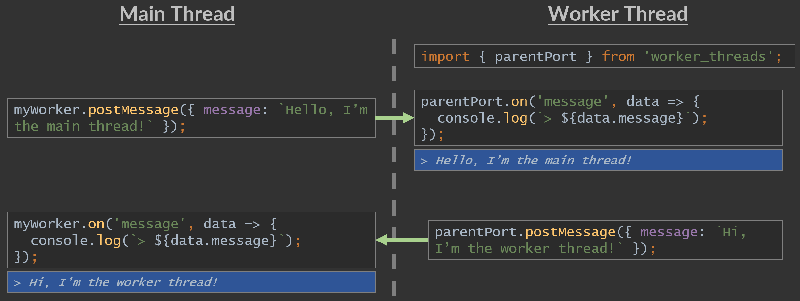

# NodeJS Multithreading 02

Custom Message

### Environment :
```
NodeJS minimal version: v12.x.x LTS (Erbium)
NodeJS recommended version: Latest LTS version
Dev Language: TypeScript (ES6)
Run Language: JavaScript
```
See [Latest NodeJS LTS version](https://nodejs.org/)

### How to run

#### First

Install packages

```
npm run i
```

#### Then

To run in Development
```
npm run start:dev
```

To run in Production
```
npm run start
```

## Explanations

In this chapter we will see how to communicate between parent and child threads.

<div align="center">

</div>

'parentPort' is imported on worker side and can be used to communicate with parent thread.

'postMessage()' method send message on the selected thread and 'on()' allow you to subscribe and receive messages from the selected thread.

You can use 'once()' instead of 'on()' to wait on 1 message only.

## Next Chapter

Multithreading 03 - Direct Thread To Thread Communication  
https://github.com/thomaspiquet/nodejs-multithreading-03